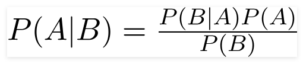

# naive bayes classifier
[source website](
https://towardsdatascience.com/naive-bayes-classifier-81d512f50a7c)

about
- a probabilistic ML model
- based on Bayes theorem

Bayes Theorem:

- the probability of A happening, given that B has occurred
- B is the evidence
- assumption: predictors/features are independent