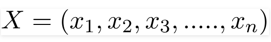

# naive bayes classifier
[source website](
https://towardsdatascience.com/naive-bayes-classifier-81d512f50a7c)

about
- a probabilistic ML model
- based on Bayes theorem

Bayes Theorem:

- the probability of A happening, given that B has occurred
- B is the evidence
- assumption: predictors/features are independent
- presence of one particular feature not affectin the other

example

- assumption1 these predictors are independent
- assumption2 all the predictors have an equal effect on the outcome

rewrite the bayes theorem:

- the variable y is the class variable(play golf in example), 
- the variable X represent the parameters/features

X is given as,

x_1,x_2….x_n represent the features

For all entries in the dataset, the denominator does not change, it remain static. Therefore, the denominator can be removed and a proportionality can be introduced.

In our case, the class variable(y) has only two outcomes, yes or no. There could be cases where the classification could be multivariate(multiclass classification). Therefore, we need to find the class y with maximum probability.

- argmax( g(y) ), y is the variable, y = ['yes','no'] 
- argmax( g(y) ), g(x) is the probaility
- argmax( g(y) ) returna an y that maximize g(y), for example if y='yes' has the largest probability, which makes g('yes')>g('no'). so argmax(g(y)) returns 'yes'. which predict 'yes' as result.

Types of Naive Bayes Classifier:
- Multinomial Naive Bayes:

    This is mostly used for document classification problem, i.e whether a document belongs to the category of sports, politics, technology etc. The features/predictors used by the classifier are the frequency of the words present in the document.
- Bernoulli Naive Bayes:

    This is similar to the multinomial naive bayes but the predictors are boolean variables. The parameters that we use to predict the class variable take up only values yes or no, for example if a word occurs in the text or not.
- Gaussian Naive Bayes:
    
    When the predictors take up a continuous value and are not discrete, we assume that these values are sampled from a gaussian distribution.

    

     the formula for conditional probability changes to

     

conclusion

    Naive Bayes algorithms are mostly used in sentiment analysis, spam filtering, recommendation systems etc. They are fast and easy to implement but their biggest disadvantage is that the requirement of predictors to be independent. In most of the real life cases, the predictors are dependent, this hinders the performance of the classifier.