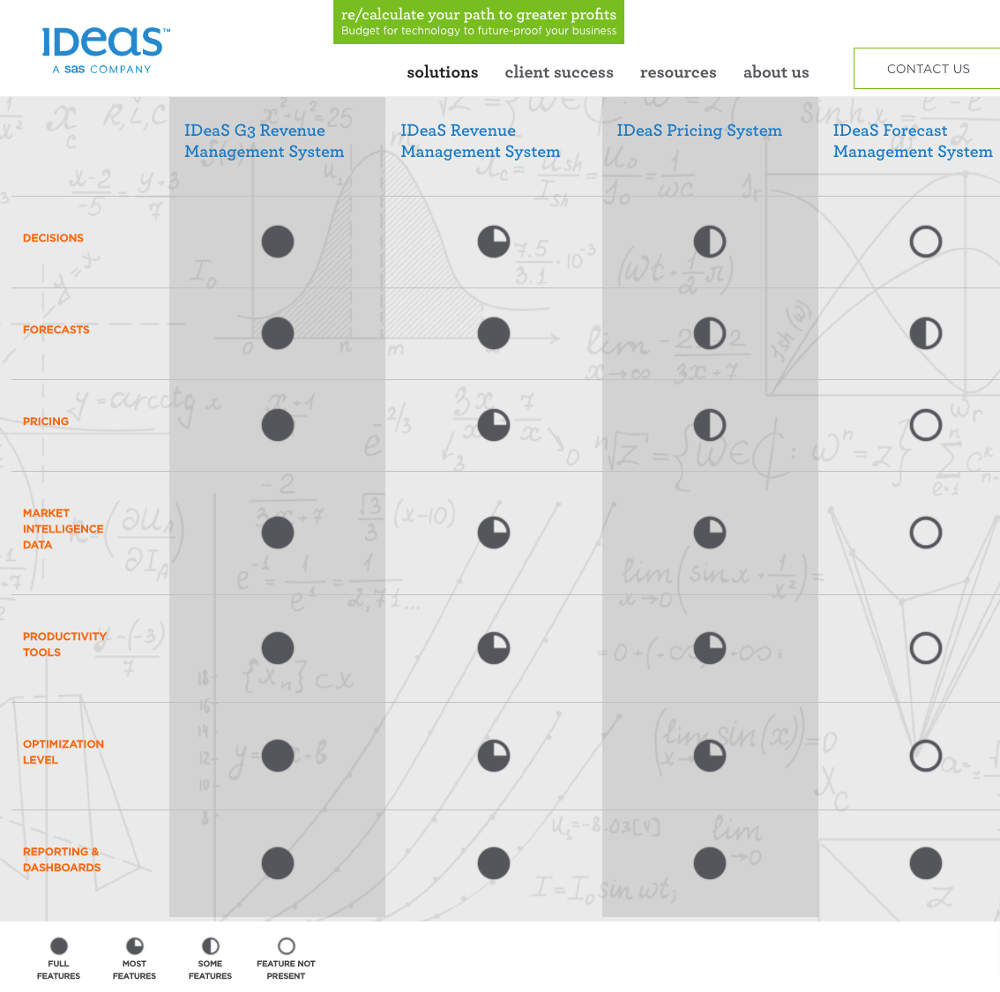
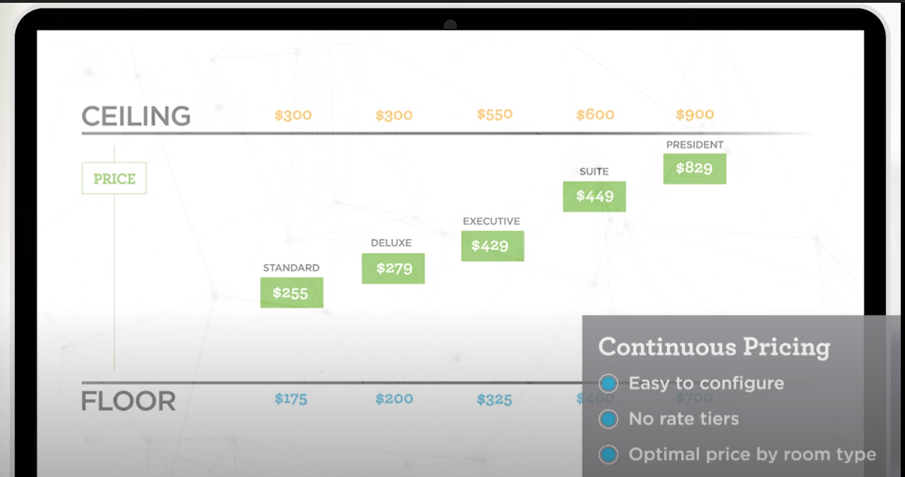
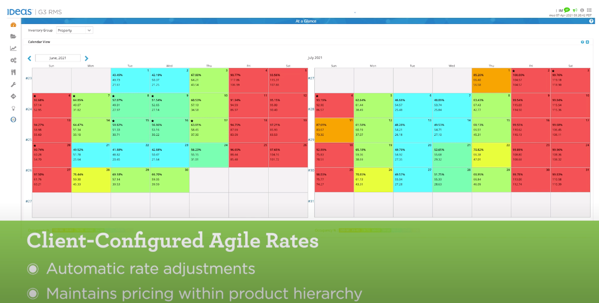
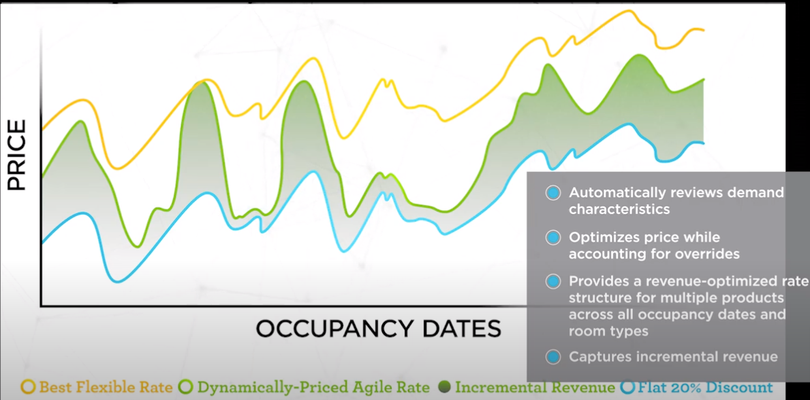
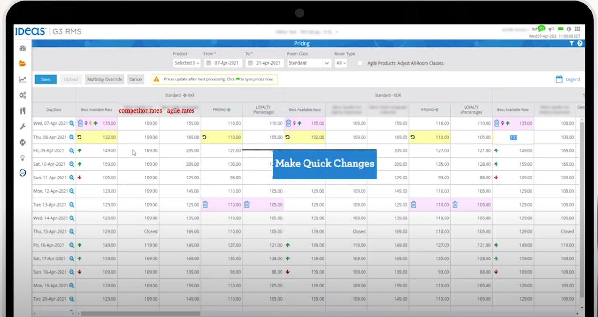

# IDEAS

## Markets
### hotels

- Continuous Pricing
    1. price each room type optimally without rate tiers
    2. define your minimum and maximum rate for each room class.
    3. analyzing demand and price sensitivity; considering all other room types, upgrade paths, and competitors
    4. provide an optimal price within the congigured range
    5. maximize revenue for each room type and occupancy date
    6. 

-  Agile Rates
    1. perfect for key products, like advance purchase, packages, promotions, loyalty tiers
    2. Additional revenue can be generated whenever the product's price can be flexed
    3. two approaches: Client-configured (clients have more control & predictability) and dynamically-priced (maximum incremental revenues)
    4. elements clients can define for both approaches: season, day of week, days to arrival, length of stay, room class, product groups, hierarchies, package elements.
    5. Client-configured agile rates:fixed amount or percentage off (client define when or how you want the rates to change)
    6. 
    7. dynamically-priced consider two factors: demand characteristics for each day by length of stay for each product; optimized for multiple products across all products
    8. 
    9. 

- what-if analysis
    1. quickly stimulate the impact that pricing, demand, wash and overbooking decisions have on forecasts and pricing

### meetings and events
### parking