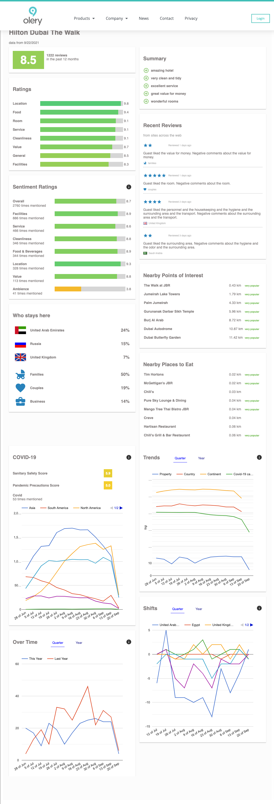

- review content
    1. from web
    2. 1m hotels
    3. 12-10days capture cycle
    4. 

- review analytics
    1. analyze businesses: how satisfied
    2. analyze destinations: strengths and weaknesss of travel destinations from neighborhood to country
    3. analyze travelers: come from? preferences? 
    4. results: ratings. reviews -> ratings like eg 'cleanliness', 'value'
    5. results: seniment: reviews ->positive/negative 
    6. reviewer profile: reviews-> country, travel composition like: fam/business

- reputation management
    1. [reputation_management.mp4](reputation_management.mp4)
