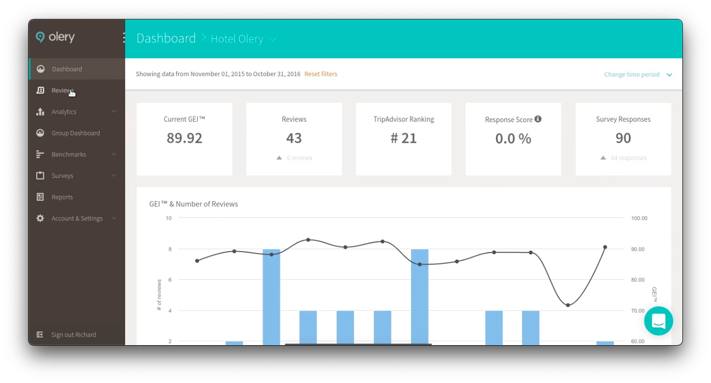
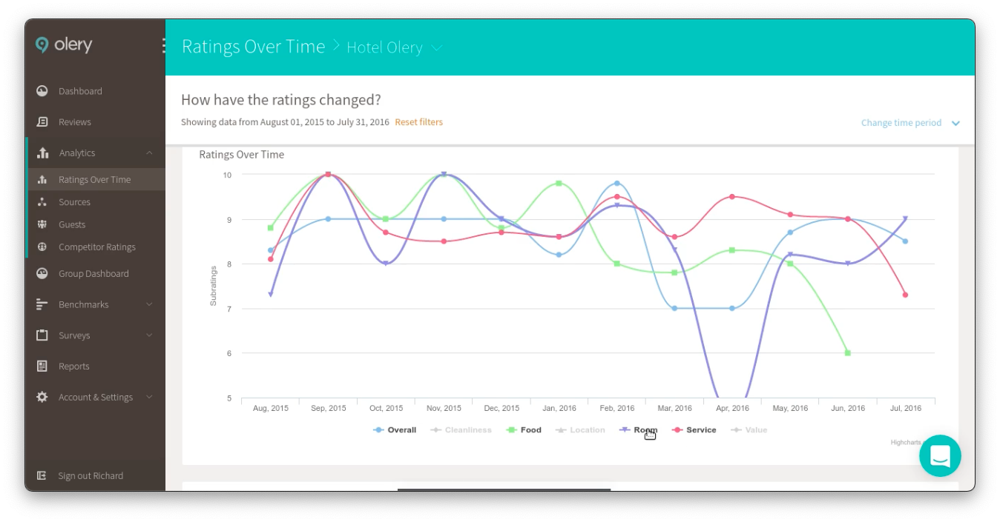
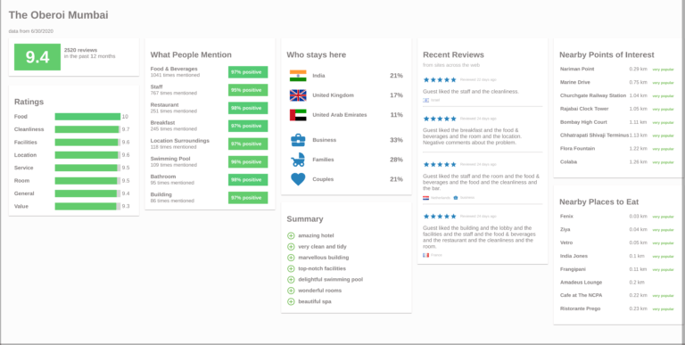
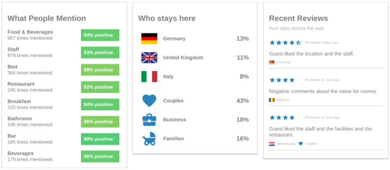
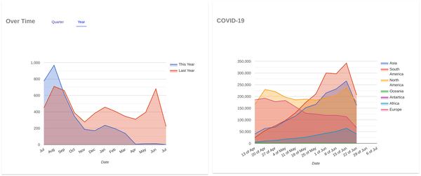

- review content
    1. from web
    2. 1M hotels
    3. 12-10days capture cycle
    4. 

- review analytics
    1. analyze businesses: how satisfied
    2. analyze destinations: strengths and weaknesss of travel destinations from neighborhood to country
    3. analyze travelers: come from? preferences? 
    4. results: ratings. reviews -> ratings like eg 'cleanliness', 'value'
    5. results: seniment: reviews ->positive/negative 
    6. reviewer profile: reviews-> country, travel composition like: fam/business

- reputation management
    1. [reputation_management.mp4](reputation_management.mp4)
    2. 
    3. 
    4. reviews rom 30+ sites
    5. track your competitors and their customers
    6. get feedback from customers(probably by email)
    7. publish feedback to sites

- data integration
    1. provide hospitality data
    2. reviews from across the web

- reputation insights
    1. people mention, locale trends, nearby places, sanitary reputation, covid mention count
    2.  
    3. 
    4. 

- retail insights
    1. monitor the performance of all your propetries.
    2. consumer driven decisions
    reviews, opinions, comments, ... -> dashboard -> decisions

- sentiment analysis
    1. reviews->tone, intent, emotion 
    2. banks of lexicons identified
        1. positive/ neutral/ negative keywords
        2. sentiment ratings keywords
    3. sentiment ratings keywords-> numerical score 1-10
    