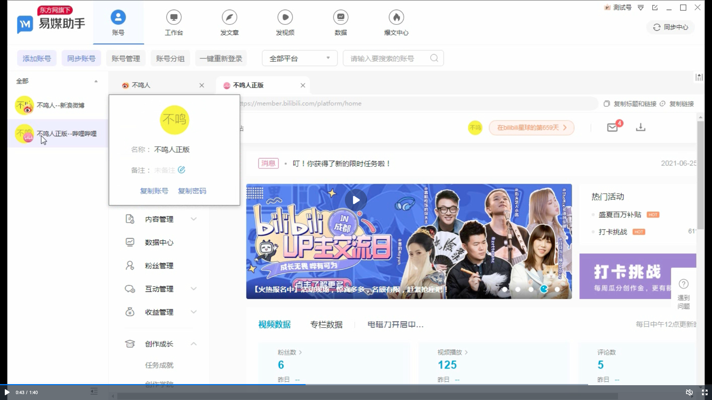

## 1 蚁小二
### 产品介绍
[site](https://yixiaoer.cn)
- 60+自媒体平台，500+账号管理，3分钟解决全平台一键发布。同时支持图文、视频、微动态的发布；​
- 
- 
- functions
    |name| intro|
    |:-|-:|
    |一键发布| 60+自媒体平台图文、视频发布参数一键配置，轻松实现3分钟一键发布|
    |账号管理|500+账号管理，根据领域、分组、类型账号实时切换、方便管理|
    |数据统计|支持按内容、部门员工、平台、账号多个维度数据进行，筛选查询，数据更新延时不超过4小时(做内容也需要有一定复杂度管理)|
    |收益统计|统计发文收益，随时反馈数据（支持屏蔽成员收益）|
    |原创质量检测|检测文章原创度、文本纠错、标题、图片、违禁词、错别字、政治敏感等多元化检测项目，让你的文章更安全，内容有价值|

###  mannuals
[site](https://knnxnt6slg.feishu.cn/docs/doccnm6vxlhCOxyMhUeSD85rMjb#1IHBJr)
-  账号管理
    - 添加账号
    
    - 编辑账号
    
    - 管理账号
    

- 数据统计
    - 平台数据
    
    - 员工数据
    
    - 账号数据
    
    - 内容数据
    

- 一键发布
    - 图文导入（图文能够通过【新建图文】、【内容管理导入】、【导入 Word】、【导入 URL 链接】四种方式导入。蚁小二支持编辑器排版及一键预览等功能。）
    
    
    - 短视频
    
    
    
    - 短内容
    
    - 设置规则(一键设置封面、分类、标签、定时发布、是否原创、双标题等平台的基本规则。)
    

- 质量检测(检测文章重复度、错别字违规信息、自媒体平台违禁词、标题图片)
    

## 2 易媒助手
[site](https://yimeizhushou.cn/)
### 功能
|name|intro|
|:-|-:|
|一键管理|50+主流平台一键管理，轻松管理1000+账号|
|一键发布|文章至20+平台；视频一键发布至30+平台；动态一键发布至微头条、百家动态、短微博|
|数据|实时统计所有账号、所有平台收益、阅读、播放、粉丝等真实数据; 实时统计所有账号，在筛选周期内阅读、播放、评论等真实数据; 监控员工所运营账号的上述数据，支持查看明细，数据图表，导出|

- 
- 
### manuals
[site](https://yimeizhushou.cn/help.html)
- 添加账号
    - 
    - 
- 发布
    - 
    - 

## 3 简媒 & 有专自媒体助手
### 简媒(60+自媒体平台)
[sites](https://www.l3gt9.com/#/)
- 
- 
### 有专自媒体助手
[sites](https://www.yzzmtzs.com/?channel=jm)
- 
- 
- 

## 4 hootsuite
[site](https://www.hootsuite.com/)

- plan ur posts
    
- create contents 
    
    