# Opentext

## 1 Product logics
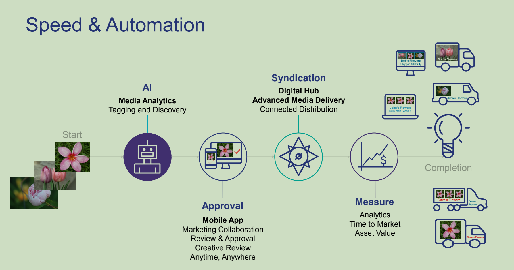
- explanations:
    - syndication: leasing the right to broadcasting on different channel
    - important: Analytics -> time-asset_value 
    - completion: buses are customers
- digital hub 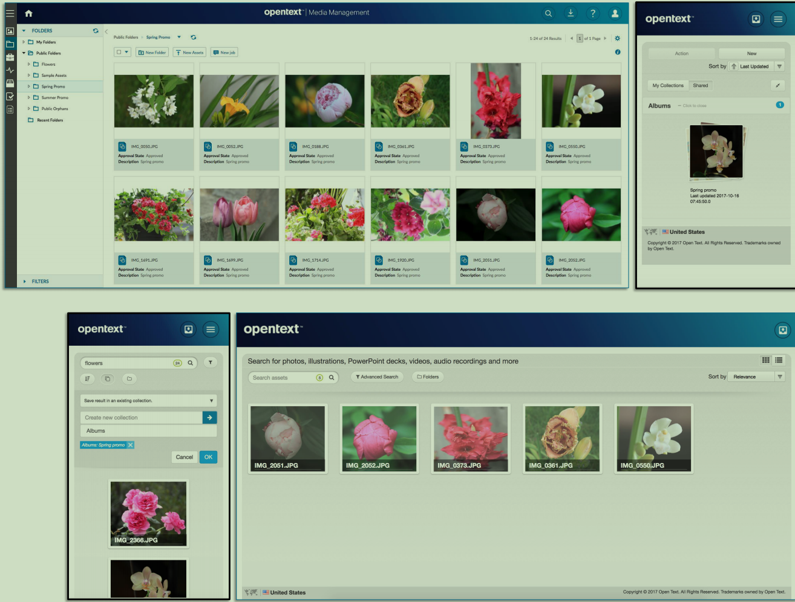
    - accelerated asset distribution
- AI 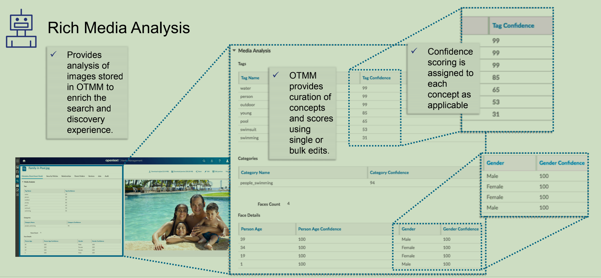
    - object detection (face)
    - tag/labels detection
    - categories <- tags/labels
- mobile app 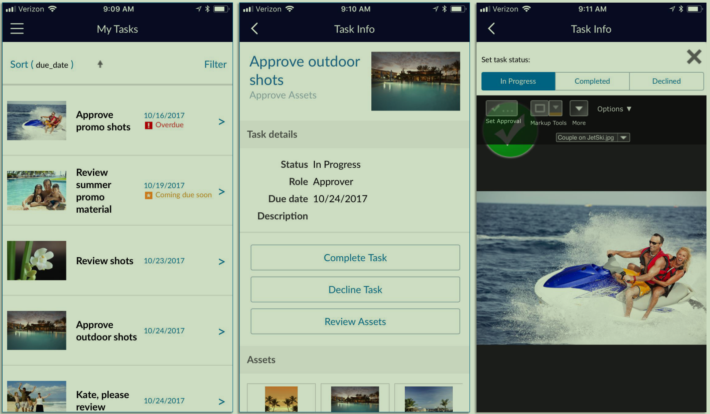
    - approve content/ reviews 

## 2 Key features
### 2.1 Adds-on and integration
|class|product|
|:-|-:|
|cloud| adobe creative cloud |
|| salesforce marketing cloud|
||Cloud CDN|
||brightcove video cloud|
|management|salsify PXM(commerce experience management)|
||adobe aem site(adobe experience manager)|
||FADEL rights management|
||SAP commerce|
|editor|microsoft office 365|
||youtube|
||IPV video workflow|
|AI|Azure Computer Vision AI|
||google vision AI|
- office 365
    - 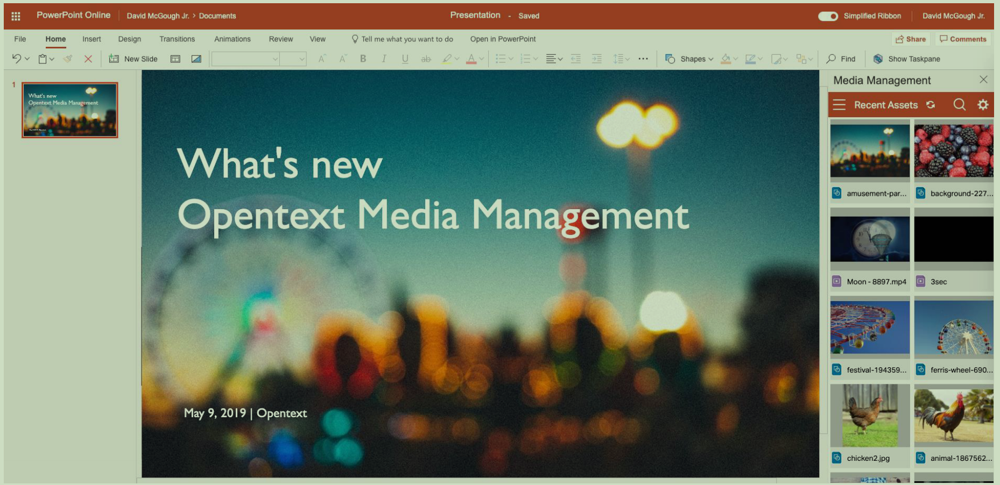
- salesforce market cloud
    - 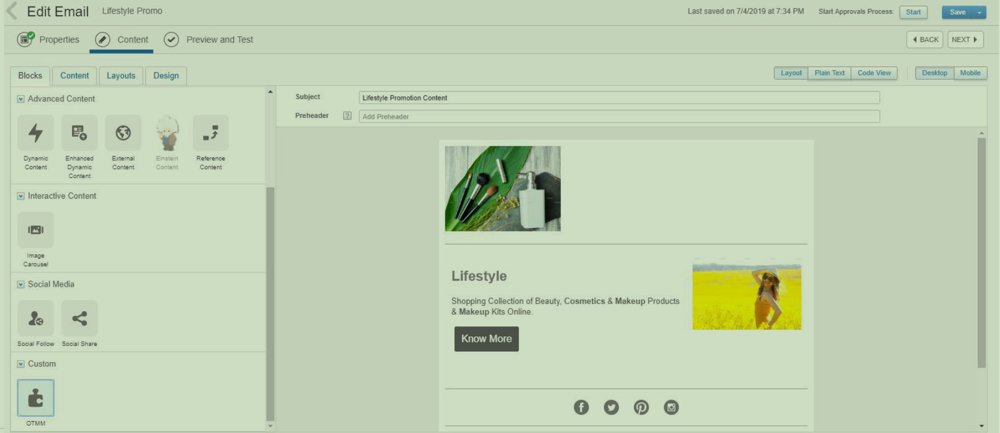
- Adobe
    - 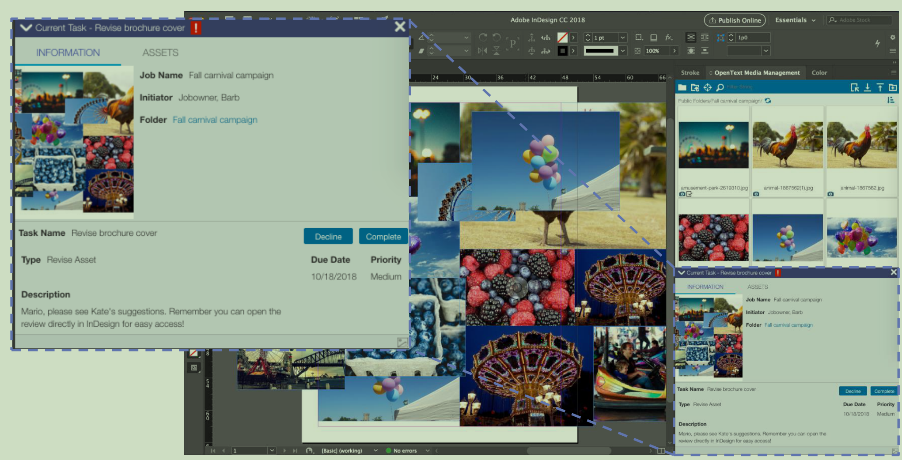

### 2.2 Automation
- two parts 
    - AI preprocess
    - Automation management for humans
- 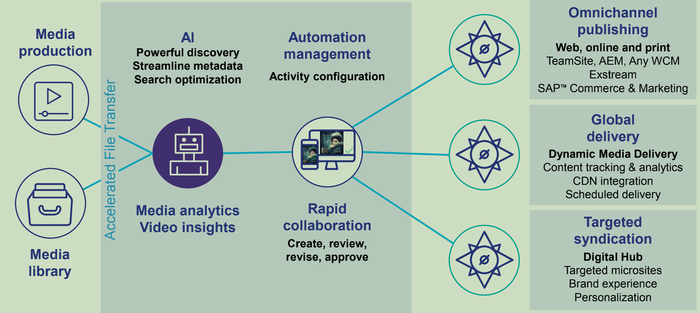

### 2.3 Calendar View of Jobs and Tasks
- create send tasks
- Filter jobs
- 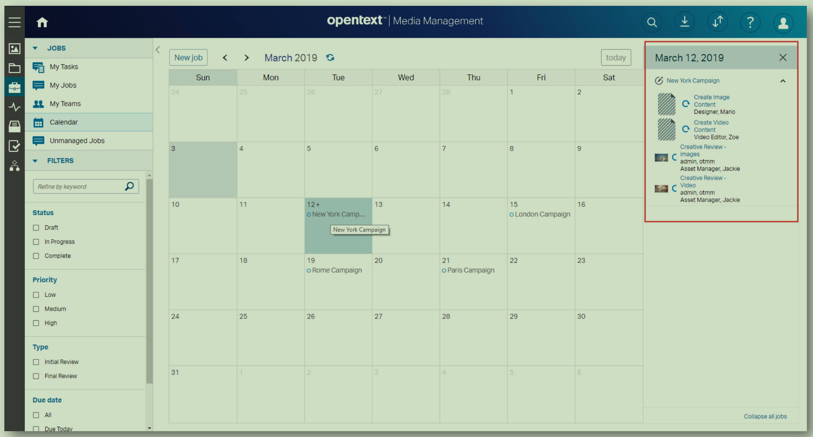

### 2.4 Curate, crop and dilivery with smart compose
- 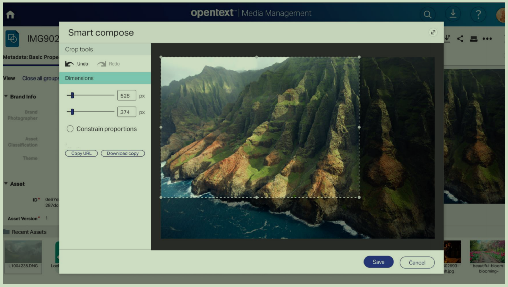

### 2.5 large file transfers
- 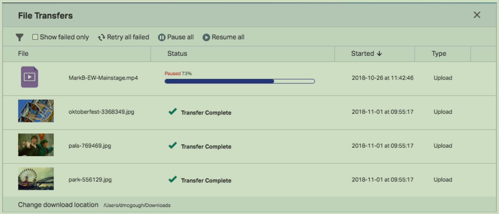

### 2.6 Activity tracking
- 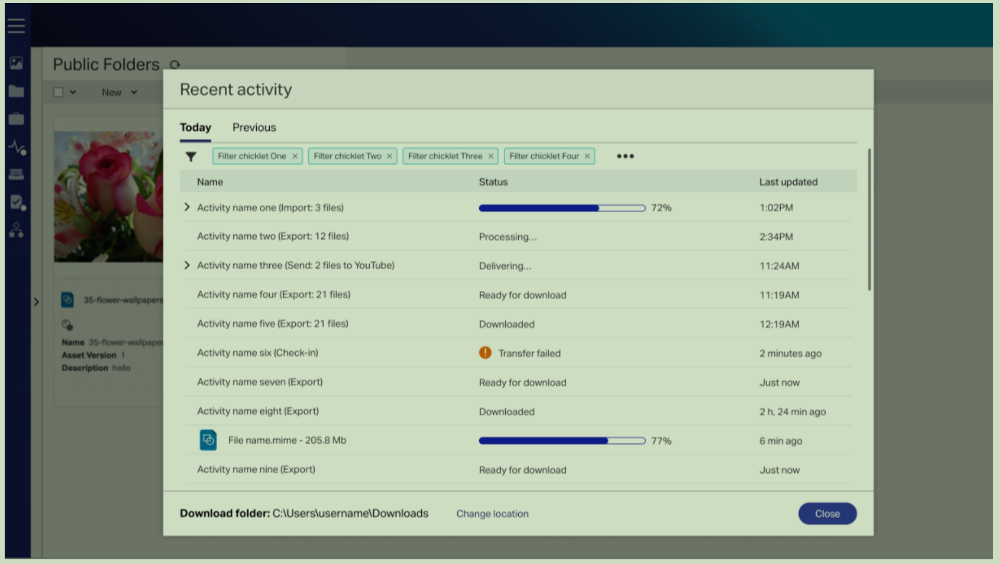

### 2.7 Scalability
- 1B assets
- 25+ metadata search per second
- large files from HD, 4k, 5k, 8k vids
- 60 PB storage
- thousands of concurrent users

### 2.8 Media Delivery Services
|approch|
|:-|
|adaptive media delivery|
|AMD-CDN integration|
|scheduled delivery|
|workflow automation|
|assest expiration|

- media/assets 
    - multiple formats and sizes
    - 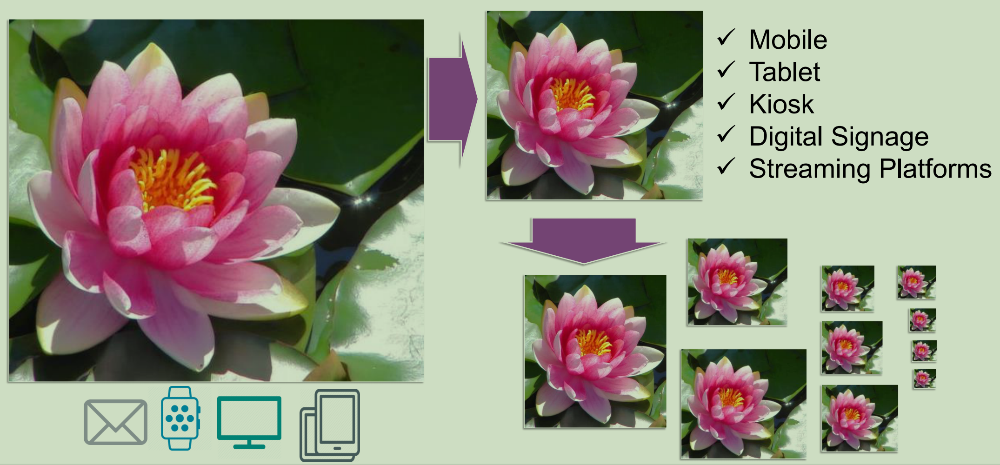

- adaptive media delivery
    - publishing 