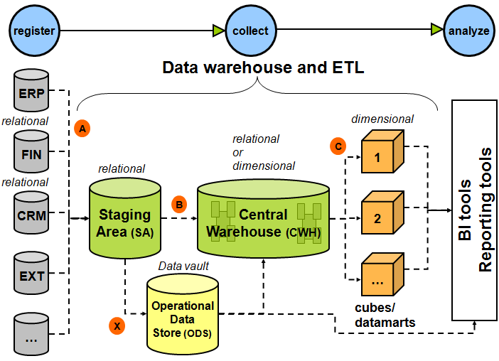

## Why clickhouse does not support transaction? 

[site](https://github.com/ClickHouse/ClickHouse/issues/19352)

Clickhouse does not support transaction will lead to duplicated data when we using spark to load data into clickhouse(spark task failed and retry will lead to this).

As i know, the reason includes:

- Clickhouse is a kind of OLAP database which is just for analysis and query
- Clickhouse delete and update operation will takes a lot of time and expensive

## clickhouse dictionaries 
[site](https://altinity.com/blog/2017/4/20/clickhouse-dictionaries-benchmarking)

## data warehouse and database

[site](https://stackoverflow.com/questions/25474114/data-warehouse-and-or-database)

- Database
    
    Transactions in an enterprise is most likely to happen in a relational database management system (aka database, aka RDBMS). Reporting can happen using the same database, but it is also possible that reporting is done off of a mirror of the RDBMS. Now, an enterprise may have more than one RDBMS - one running SQL Server, one running Oracle, one running MySQL etc. All this is great for recording activities and reporting.

- Warehouse

    Additionally, enterprises seek to do data analysis on a regular basis. Business Intelligence, data science, big data - regardless of the term, we are talking about data analysis overall. Doing number crunching on large amounts of data stored in an RDBMS can be hard on the RDBMS. So, organizations decide to de-normalize data to some extent and store data in a warehouse. When data is extracted, transformed and loaded (ETL) from one or more RDBMS (and other sources of data) and stored in a data warehouse, it is available for some research.

    Organizations may choose to move the warehouse to a different office location, or may have multiple-warehouses. For example, a headquarter with 5 satellite facilities may choose to bring data from all those facilities to the warehouse at the headquarter every night, or it may choose to have a warehouse in a different datacenter. In contrast to that, a company with hundreds of satellite facilities may choose to have a warehouse with high-level summarized data at their headquarter and regionalize their warehouses; one warehouse in each continent, so that target markets are better served by satellite units in that particular continent.

## distributed, shard, replicated

[site](https://github.com/ClickHouse/ClickHouse/issues/2161)

Generally: the main engine in Clickhouse is called MergeTree. It allows to store and process data on one server and feel all the advantages of Clickhouse. Basic usage of MergeTree does not require any special configuration, and you can start using it 'out of the box'.

But one server and one copy of data is not fault-tolerant - something can happen with server itself, with datacenter availability etc. So you need to have the replica(s) - i.e. server(s) with same data and which can 'substitute' the original server it any moment.

To have an extra copy (replica) of your data you need to use ReplicatedMergeTree engine. It can be used instead of MergeTree engine, and you can always upgrade from MergeTree to ReplicatedMergeTree (and downgrade back) if you need. To use that you need to have ZooKeeper installed and running. For tests you can use one standalone Zookeeper instance, but for production usage you should have zookeeper ensemble at least of 3 servers.

When you use ReplicatedMergeTree then the inserted data is copied automatically to all the replicas, but all the SELECTs are executed on the server you have connected to. So you can have 5 replicas of your data, but if will always connect to one replica - it will not 'share' / 'balance' that traffic automatically between all the replicas, one server will be loaded and the rest will generally do nothing. If you need that balancing of load between multiple replicas - you can use internal 'loadbalancer' mechanism which is provided by Distrtibuted engine of Clickhouse. As an alternative in that scenario you can work without Distribured table, but with some external loadbalancer which will balance the requests between several replicas according to your specific rules or preferences.

Distributed engine does not store any data, but it can 'point' to same ReplicatedMergeTree/MergeTree table on multiple servers. To use Distributed engine you need to configure &lt;cluser&gt; settings in your ClickHouse server config file.

So let's say you have 3 replicas of table my_replicated_data with ReplicatedMergeTree engine. You can create a table with Distrtibuted engine called my_distributed_replicated_data which will 'point' to all of that 3 servers, and when you will select from that my_distributed_replicated_data table the select will be forwarded and executed on one of the replicas. So in that scenario each of the replica will get 1/3 of requests (but each request still will be fully executed on one chosen replica).

All that is great, and will work good while one copy of your data is fitting one one physical server, and can be processed by the resources of one server. When you have too much data to be stored/processed on one server - you need to use sharding (it's just a way to split the data to smaller parts). Sharding is the mechanism also provided be Distributed engine.

With sharding data is divided into parts (shards) according to some sharding key. You can just use random distribution, so let's say - throw a coin to decide on each of the server the data should be stored, or you can use some 'smarter' sharding scheme, to make the data connected to the same subject (let's say to the same customer) stored on one server, and to another subject on another. So in that case all the shards should be requested at the same time and later the 'common' result should be calculated.

In ClickHouse each shard work independently and process its' part of data, inside each shard replication can work. And later to query all the shards at the same time and combine the final result - Distributed engine is used. So Distributed work as loadbalancer inside each shard, and can combine the data coming from different shards together to make the 'common' result.

You can use Distribured table for inserts, it that case it will pass the data to one of the shards according to sharding key. Or you can insert to underlying table on one of the shards bypassing the Distributed table.

## dont use redshift as an OLTP database

It is common to connect an application framework like Django to Amazon Redshift. This is useful when using Redshift data in your application, i.e. in an OLTP scenario. Since Amazon Redshift is an OLAP database, it may not handle these queries well.  

The challenge of using Redshift as an OLTP database is that queries can <mark>lack the low-latency that would exist on a traditional RDBMS and transactional queries. Unlike OLTP databases, OLAP databases do not use an index. This is a result of the column-oriented data storage design of Amazon Redshift which makes the trade-off to perform better for big data analytical workloads</mark>.

[site](https://www.intermix.io/blog/dont-use-redshift-as-an-oltp-database/)

