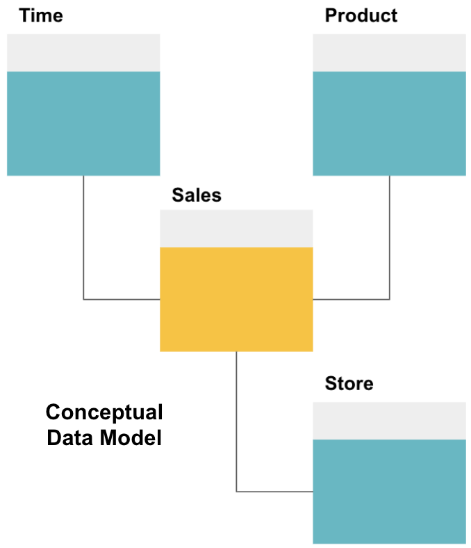
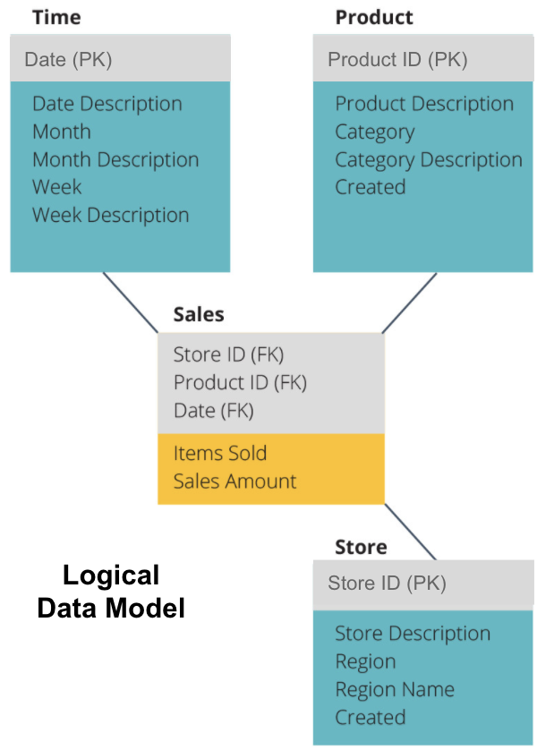
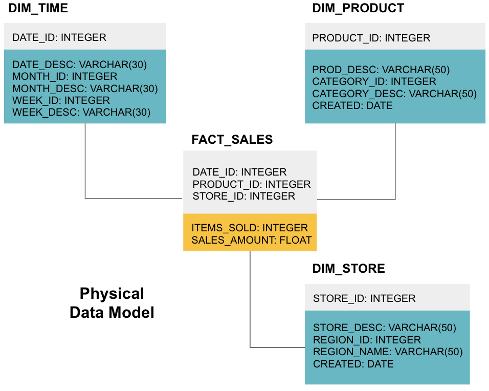
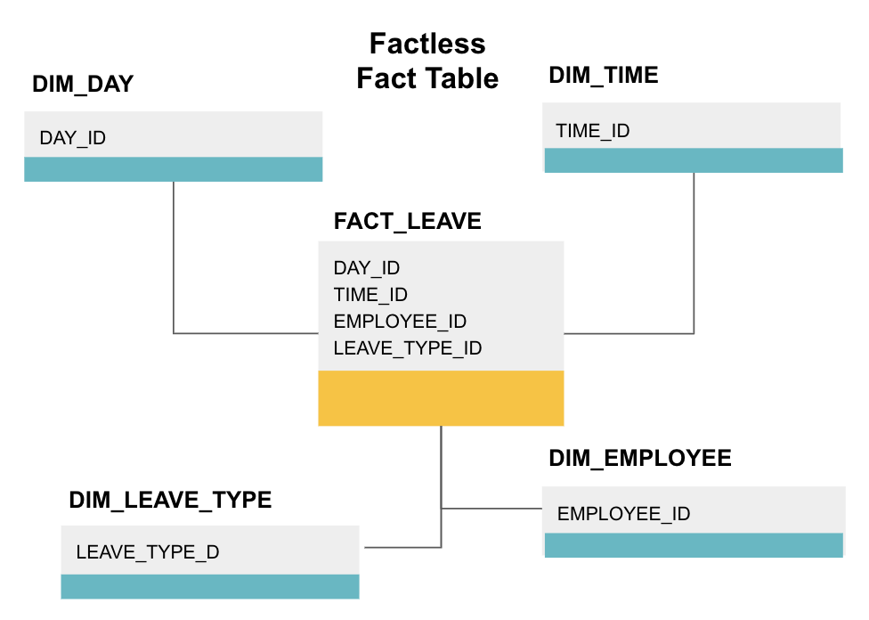
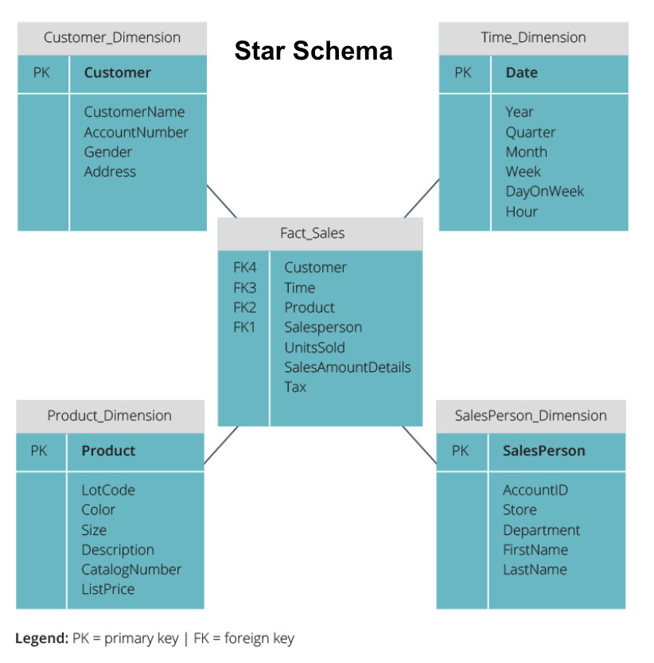
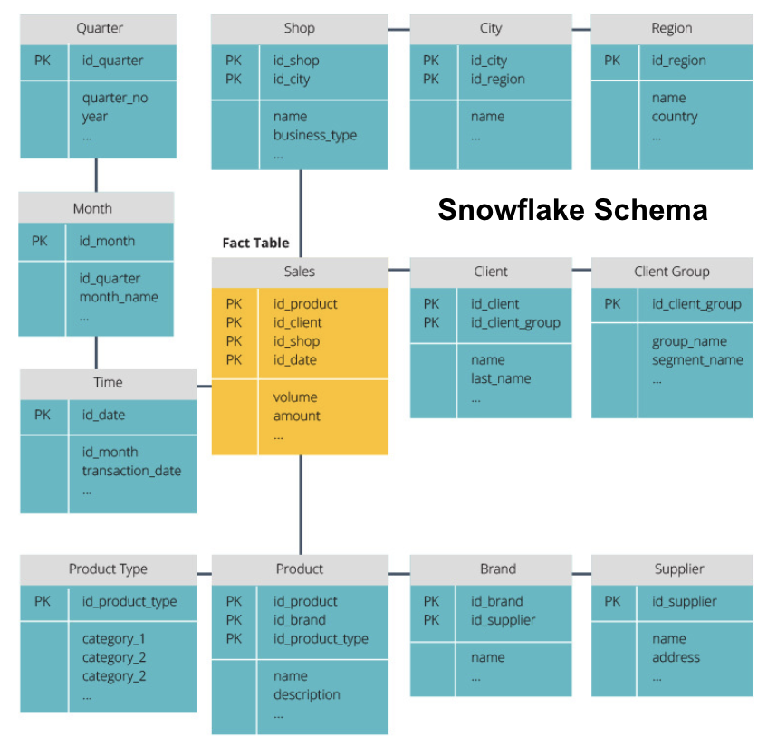

## Facts, Dimensions, and Measures
A fact is the part of your data that indicates a specific occurrence or transaction. For example, if your business sells flowers, some facts you would see in your data warehouse are:
- Sold 30 roses in-store for $19.99
- Ordered 500 new flower pots from China for $1500
- Paid salary of cashier for this month $1000

Several numbers can describe each fact, and we call these numbers measures. Some measures to describe the fact ‘ordered 500 new flower pots from China for $1500’ are:

- Quantity ordered - 500
- Cost - $1500

When analysts are working with data, they perform calculations on measures (e.g., sum, maximum, average) to glean insights. For example, you may want to know the average number of flower pots you order each month.

A dimension categorizes facts and measures and provides structured labeling information for them - otherwise, they would just be a collection of unordered numbers! Some dimensions to describe the fact ‘ordered 500 new flower pots from China for $1500’ are:
- Country purchased from - China
- Time purchased - 1 pm
- Expected date of arrival - June 6th

You cannot perform calculations on dimensions explicitly, and doing so probably would not be very helpful - how can you find the ‘average arrival date for orders’? However, it is possible to create new measures from dimensions, and these are useful. For example, if you know the average number of days between the order date and arrival date, you can better plan stock purchases.

## Normalization and Denormalization
Normalization is the process of efficiently organizing data in a data warehouse (or any other place that stores data). The main goals are to reduce data redundancy - i.e., remove any duplicate data - and improve data integrity - i.e., improve the accuracy of data. There are different [levels of normalization](https://en.wikipedia.org/wiki/Database_normalization#Normal_forms) and no consensus for the ‘best’ method. However, all methods involve storing separate but related pieces of information in different tables.

There are many benefits to normalization, such as:

- Faster searching and sorting on each table
- Simpler tables make data modification commands faster to write and execute
- Less redundant data means you save on disk space, and so you can collect and store more data

Denormalization is the process of ***deliberately adding redundant copies or groups of data to already normalized data***. It is not the same as un-normalized data. Denormalization improves the read performance and makes it much easier to manipulate tables into forms you want. When analysts work with data warehouses, they typically only perform reads on the data. Thus, denormalized data can save them vast amounts of time and headaches.

Benefits of denormalization:

Fewer tables minimize the need for table joins which speeds up data analysts’ workflow and leads them discovering more useful insights in the data
Fewer tables simplify queries leading to fewer bugs

## Data Models

The first step in designing a data warehouse is to build a conceptual data model that defines the data you want and the high-level relationships between them.

Here, we have defined the conceptual model. We are storing Sales data and have three additional tables - Time, Product, and Store - that provide extra, more granular information about each sale. The fact table is Sales, and the others are dimension tables.

The next step is to define a logical data model. This model describes the data in detail in plain English without worrying about how to implement it in code.

Now we have filled out which information each table contains in plain English. Each of the Time, Product, and Store dimension tables shows the Primary Key (PK) in the grey box and the corresponding data in the blue boxes. The Sales table contains three Foreign Keys (FK) so that it can quickly join with the other tables.

The final stage is to create a physical data model. This model tells you how to implement the data warehouse in code. It defines tables, their structure, and the relationship between them. It also specifies data types for columns, and everything is named as it will be in the final data warehouse, i.e., all caps and connected with underscores. Lastly, <mark>each dimension table starts with DIM_, and each fact table starts with FACT_</mark>.

## Fact Table

Each business function - e.g., sales, marketing, finance - has a corresponding fact table.

Fact tables have two types of columns: dimension columns and fact columns. Dimension columns - colored grey in our examples - contain Foreign Keys (FK) that you use to join a fact table with a dimension table. These foreign keys are the Primary Keys (PK) for each of the dimension tables. Fact columns - colored yellow in our examples - contain the actual data and measures to be analyzed, e.g., the number of items sold and the total dollar value of sales.

A factless fact table is a particular type of fact table that only has dimension columns. Such tables are useful for tracking events, such as student attendance or employee leave, as the dimensions tell you everything you need to know about the events.

The above factless fact table tracks employee leave. There are no facts since you just need to know:

- What day they were off (DAY_ID).
- How long they were off (TIME_ID).
- Who was on leave (EMPLOYEE_ID).
- Their reason for being on leave, e.g., illness, holiday, doctor’s appointment, etc. (LEAVE_TYPE_ID).

## Star Schema vs. Snowflake Schema

The above data warehouses have all had a similar layout. However, this is not the only way to arrange them.

The two most common schemas used to organize data warehouses are star and snowflake. Both methods use dimension tables that describe the information contained within a fact table.

The star schema takes the information from the fact table and splits it into denormalized dimension tables. The emphasis for the star schema is on query speed. Only one join is needed to link fact tables to each dimension, so querying each table is easy. However, since the tables are denormalized, they often contain repeated and redundant data.

The snowflake schema splits the fact table into a series of normalized dimension tables. Normalizing creates more dimension tables, and so reduces data integrity issues. However, querying is more challenging using the snowflake schema because you need more table joins to access the relevant data. So, you have less redundant data, but it is harder to access.

## OLAP vs. OLTP

Online transaction processing (OLTP) is characterized by short write transactions that involve the front-end applications of an enterprise’s data architecture. OLTP databases emphasize fast query processing and only deal with current data. Businesses use these to capture information for business processes and provide source data for the data warehouse.

Online analytical processing (OLAP) allows you to run complex read queries and thus perform a detailed analysis of historical transactional data. OLAP systems help to analyze the data in the data warehouse.

## Three Tier Architecture

Traditional data warehouses are typically structured in three tiers:

- Bottom Tier: A database server, typically an RDBMS, that extracts data from different sources using a gateway. Data sources fed into this tier include operational databases and other types of front-end data such as CSV and JSON files.
- Middle Tier: An OLAP server that either
    - Directly implements the operations, or
    - Maps the operations on multidimensional data to standard relational operations, e.g., flattening XML or JSON data into rows within tables.
- Top Tier: The querying and reporting tools for data analysis and business intelligence.

